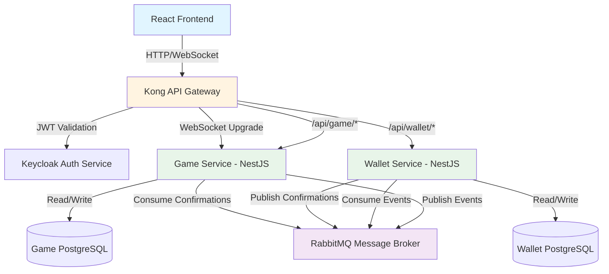
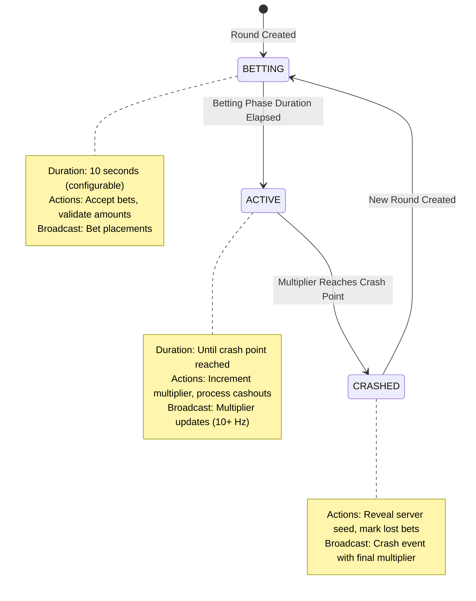
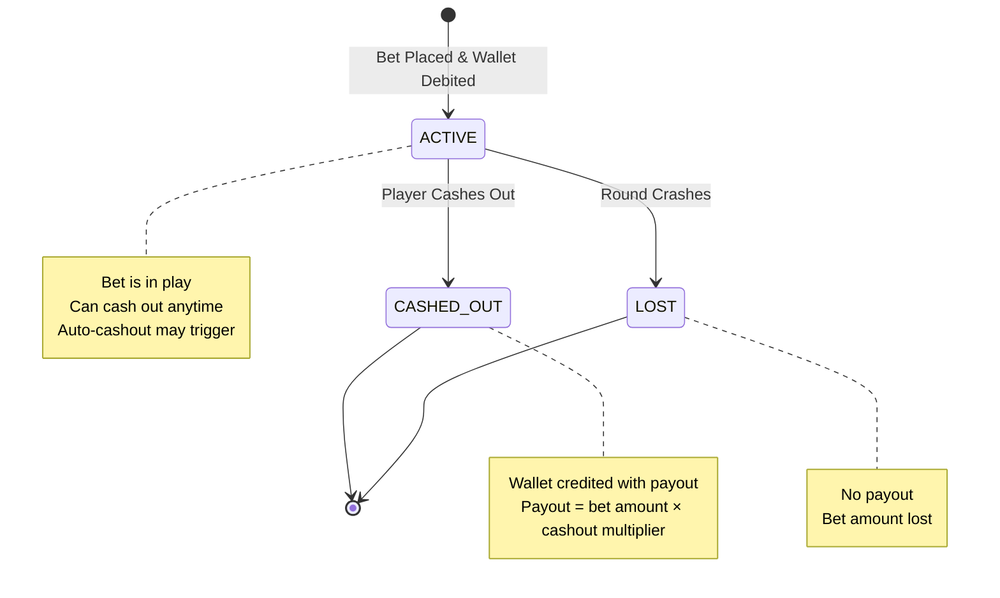

# Design Document: Crash Game Platform

## Overview

The Crash Game Platform is a full-stack multiplayer casino gaming system implementing a provably fair crash game where players bet on a continuously rising multiplier that crashes at an unpredictable point. The system uses a microservices architecture with separate Game and Wallet services, real-time WebSocket communication, and cryptographic algorithms to ensure game fairness and integrity.

### Core Concepts

**Game Mechanics**: Players place bets during a betting phase (default 10 seconds), then watch a multiplier rise from 1.00x during the active phase. Players must cash out before the multiplier crashes to win their bet amount multiplied by the current multiplier. The crash point is predetermined using a provably fair algorithm but hidden until the crash occurs.

**Provably Fair Gaming**: The system uses HMAC-SHA256 hash chains with server seeds, client seeds, and nonces to generate crash points. Players can verify that crash points were predetermined and not manipulated by the house.

**Microservices Architecture**: The platform separates concerns into Game Service (round lifecycle, betting, WebSocket), Wallet Service (balance management, transactions), with Kong API Gateway for routing and Keycloak for authentication.

### Technology Stack

- **Backend**: NestJS (TypeScript) with microservices architecture
- **Frontend**: React/Next.js with Socket.IO client
- **Databases**: PostgreSQL (separate instances for Game and Wallet services)
- **Message Broker**: RabbitMQ for asynchronous inter-service communication
- **API Gateway**: Kong for routing, rate limiting, and JWT validation
- **Authentication**: Keycloak (OIDC/JWT)
- **Real-time Communication**: WebSocket (Socket.IO)
- **Containerization**: Docker Compose for development environment

## Architecture

### System Architecture Diagram



### Service Boundaries and Responsibilities

**Game Service**:

- Round lifecycle management (betting phase → active phase → crash)
- Bet placement validation and recording
- Cash out processing
- Provably fair crash point generation
- WebSocket connection management
- Real-time multiplier broadcasting
- Round history tracking

**Wallet Service**:

- Player wallet management
- Balance operations (debit/credit)
- Transaction history
- Idempotent transaction processing
- Balance integrity enforcement

**API Gateway (Kong)**:

- Request routing to appropriate services
- JWT token validation
- Rate limiting (100 requests/minute per player)
- CORS policy enforcement
- Request correlation ID injection
- Access logging

**Auth Service (Keycloak)**:

- Player authentication
- JWT token issuance
- Identity and role management

### Communication Patterns

**Synchronous (HTTP/REST)**:

- Client → Gateway → Services: Player-initiated actions (place bet, query balance)
- Service → Service: Not used (services don't make direct HTTP calls to each other)

**Asynchronous (Message Broker)**:

- Game Service → Wallet Service: Debit requests (bet placement), Credit requests (payouts)
- Wallet Service → Game Service: Operation confirmations/failures
- Pattern: Request-Response via message queues with correlation IDs

**Real-time (WebSocket)**:

- Game Service → All Clients: Round state updates, multiplier updates, bet broadcasts, cash out broadcasts, crash events
- Client → Game Service: Cash out requests, connection establishment

## Components and Interfaces

### Game Service Components

#### Domain Layer

**Round Aggregate**:

```typescript
class Round {
  id: string;
  status: RoundStatus; // BETTING | ACTIVE | CRASHED
  crashPoint: number;
  serverSeed: string;
  serverSeedHash: string;
  clientSeed: string;
  nonce: number;
  bettingPhaseStartTime: Date;
  activePhaseStartTime: Date | null;
  crashTime: Date | null;
  currentMultiplier: number;
  bets: Map<string, Bet>;
  
  // Domain methods
  startBettingPhase(): void;
  transitionToActivePhase(): void;
  placeBet(playerId: string, amount: number): Result<Bet>;
  cashOut(playerId: string, multiplier: number): Result<CashOut>;
  crash(): void;
  canPlaceBet(): boolean;
  canCashOut(playerId: string): boolean;
}
```

**Bet Entity**:

```typescript
class Bet {
  id: string;
  roundId: string;
  playerId: string;
  amount: number; // Stored as integer cents
  status: BetStatus; // ACTIVE | CASHED_OUT | LOST
  cashOutMultiplier: number | null;
  cashOutTime: Date | null;
  payout: number | null; // Stored as integer cents
  autoCashoutMultiplier: number | null;
  
  cashOut(multiplier: number): void;
  markAsLost(): void;
}
```

**ProvablyFairService (Domain Service)**:

```typescript
class ProvablyFairService {
  generateServerSeed(): string;
  hashServerSeed(seed: string): string;
  generateCrashPoint(serverSeed: string, clientSeed: string, nonce: number): number;
  verifyCrashPoint(serverSeed: string, clientSeed: string, nonce: number, expectedCrashPoint: number): boolean;
}
```

#### Application Layer

**RoundOrchestrator**:

- Manages round lifecycle state machine
- Coordinates round transitions
- Schedules betting phase duration
- Triggers multiplier updates during active phase
- Handles crash event

**BettingService**:

- Validates bet placement requests
- Publishes debit requests to message broker
- Records bets after wallet confirmation
- Handles bet rejection scenarios

**CashOutService**:

- Validates cash out requests
- Calculates payouts
- Publishes credit requests to message broker
- Records cash outs after wallet confirmation
- Handles auto-cashout logic

**WebSocketGateway**:

- Manages client connections
- Broadcasts round events to all clients
- Handles client-initiated cash out requests
- Sends current state to newly connected clients

#### Infrastructure Layer

**RoundRepository**:

- Persists round state to PostgreSQL
- Queries round history
- Implements optimistic locking for concurrent updates

**BetRepository**:

- Persists bet records
- Queries active bets for a round
- Supports efficient in-memory caching of active round bets

**MessageBrokerClient**:

- Publishes events to RabbitMQ
- Consumes wallet confirmation events
- Implements retry logic with exponential backoff
- Ensures idempotent message handling

### Wallet Service Components

#### Domain Layer

**Wallet Aggregate**:

```typescript
class Wallet {
  id: string;
  playerId: string;
  balance: number; // Stored as integer cents, never negative
  version: number; // For optimistic locking
  
  // Domain methods
  debit(amount: number, transactionId: string): Result<Transaction>;
  credit(amount: number, transactionId: string): Result<Transaction>;
  hassufficientBalance(amount: number): boolean;
}
```

**Transaction Entity**:

```typescript
class Transaction {
  id: string;
  walletId: string;
  type: TransactionType; // DEBIT | CREDIT
  amount: number; // Stored as integer cents
  balanceAfter: number;
  reason: string; // "BET_PLACED" | "PAYOUT"
  referenceId: string; // Bet ID or payout ID
  createdAt: Date;
  idempotencyKey: string;
}
```

#### Application Layer

**WalletService**:

- Processes debit/credit requests from message broker
- Ensures atomic balance updates with transaction recording
- Publishes confirmation/failure events
- Implements idempotency using transaction reference IDs
- Provides balance query endpoint

#### Infrastructure Layer

**WalletRepository**:

- Persists wallet state with optimistic locking
- Ensures balance never goes negative via database constraints
- Atomic balance updates within database transactions

**TransactionRepository**:

- Persists transaction history
- Queries transaction history for players
- Supports idempotency checks

### API Specifications

#### Game Service REST Endpoints

**GET /api/game/rounds/current**

- Description: Get current round state
- Auth: Required (JWT)
- Response:

```json
{
  "roundId": "uuid",
  "status": "BETTING | ACTIVE | CRASHED",
  "currentMultiplier": 1.23,
  "crashPoint": null,
  "serverSeedHash": "hash",
  "bettingPhaseEndsAt": "ISO8601",
  "activeBets": [
    {
      "playerId": "uuid",
      "amount": 1000,
      "status": "ACTIVE"
    }
  ]
}
```

**POST /api/game/bets**

- Description: Place a bet in current round
- Auth: Required (JWT)
- Request:

```json
{
  "amount": 1000,
  "autoCashoutMultiplier": 2.5
}
```

- Response:

```json
{
  "betId": "uuid",
  "roundId": "uuid",
  "amount": 1000,
  "status": "PENDING"
}
```

- Errors: 400 (invalid amount), 403 (betting phase ended), 409 (already bet in round), 402 (insufficient balance)

**GET /api/game/rounds/history**

- Description: Get past round results
- Auth: Required (JWT)
- Query: `?limit=10&offset=0`
- Response:

```json
{
  "rounds": [
    {
      "roundId": "uuid",
      "crashPoint": 2.34,
      "serverSeed": "revealed",
      "clientSeed": "seed",
      "nonce": 123,
      "crashedAt": "ISO8601"
    }
  ]
}
```

**POST /api/game/verify**

- Description: Verify provably fair crash point
- Auth: Optional
- Request:

```json
{
  "serverSeed": "seed",
  "clientSeed": "seed",
  "nonce": 123
}
```

- Response:

```json
{
  "calculatedCrashPoint": 2.34,
  "isValid": true
}
```

#### Wallet Service REST Endpoints

**GET /api/wallet/balance**

- Description: Get current wallet balance
- Auth: Required (JWT)
- Response:

```json
{
  "balance": 100000,
  "currency": "cents"
}
```

**GET /api/wallet/transactions**

- Description: Get transaction history
- Auth: Required (JWT)
- Query: `?limit=50&offset=0`
- Response:

```json
{
  "transactions": [
    {
      "id": "uuid",
      "type": "DEBIT",
      "amount": 1000,
      "balanceAfter": 99000,
      "reason": "BET_PLACED",
      "createdAt": "ISO8601"
    }
  ]
}
```

#### WebSocket Events

**Server → Client Events**:

`round:started`

```json
{
  "roundId": "uuid",
  "serverSeedHash": "hash",
  "bettingPhaseEndsAt": "ISO8601"
}
```

`round:active`

```json
{
  "roundId": "uuid",
  "startedAt": "ISO8601"
}
```

`multiplier:update`

```json
{
  "roundId": "uuid",
  "multiplier": 1.23,
  "timestamp": "ISO8601"
}
```

`bet:placed`

```json
{
  "betId": "uuid",
  "playerId": "uuid",
  "amount": 1000,
  "autoCashout": 2.5
}
```

`cashout:success`

```json
{
  "betId": "uuid",
  "playerId": "uuid",
  "multiplier": 1.85,
  "payout": 1850
}
```

`round:crashed`

```json
{
  "roundId": "uuid",
  "crashPoint": 2.34,
  "serverSeed": "revealed",
  "crashedAt": "ISO8601"
}
```

**Client → Server Events**:

`cashout:request`

```json
{
  "roundId": "uuid"
}
```

### Message Broker Events

**Game Service → Wallet Service**:

`wallet.debit.request`

```json
{
  "correlationId": "uuid",
  "playerId": "uuid",
  "amount": 1000,
  "reason": "BET_PLACED",
  "referenceId": "bet-uuid",
  "timestamp": "ISO8601"
}
```

`wallet.credit.request`

```json
{
  "correlationId": "uuid",
  "playerId": "uuid",
  "amount": 1850,
  "reason": "PAYOUT",
  "referenceId": "bet-uuid",
  "timestamp": "ISO8601"
}
```

**Wallet Service → Game Service**:

`wallet.debit.confirmed`

```json
{
  "correlationId": "uuid",
  "success": true,
  "transactionId": "uuid",
  "balanceAfter": 99000
}
```

`wallet.debit.failed`

```json
{
  "correlationId": "uuid",
  "success": false,
  "reason": "INSUFFICIENT_BALANCE"
}
```

`wallet.credit.confirmed`

```json
{
  "correlationId": "uuid",
  "success": true,
  "transactionId": "uuid",
  "balanceAfter": 100850
}
```

## Data Models

### Game Service Database Schema

**rounds table**:

```sql
CREATE TABLE rounds (
  id UUID PRIMARY KEY DEFAULT gen_random_uuid(),
  status VARCHAR(20) NOT NULL CHECK (status IN ('BETTING', 'ACTIVE', 'CRASHED')),
  crash_point NUMERIC(10, 2) NOT NULL,
  server_seed VARCHAR(128) NOT NULL,
  server_seed_hash VARCHAR(64) NOT NULL,
  client_seed VARCHAR(128) NOT NULL,
  nonce INTEGER NOT NULL,
  betting_phase_start_time TIMESTAMP NOT NULL,
  active_phase_start_time TIMESTAMP,
  crash_time TIMESTAMP,
  created_at TIMESTAMP DEFAULT NOW(),
  updated_at TIMESTAMP DEFAULT NOW()
);

CREATE INDEX idx_rounds_status ON rounds(status);
CREATE INDEX idx_rounds_created_at ON rounds(created_at DESC);
```

**bets table**:

```sql
CREATE TABLE bets (
  id UUID PRIMARY KEY DEFAULT gen_random_uuid(),
  round_id UUID NOT NULL REFERENCES rounds(id) ON DELETE RESTRICT,
  player_id UUID NOT NULL,
  amount BIGINT NOT NULL CHECK (amount > 0),
  status VARCHAR(20) NOT NULL CHECK (status IN ('ACTIVE', 'CASHED_OUT', 'LOST')),
  cash_out_multiplier NUMERIC(10, 2),
  cash_out_time TIMESTAMP,
  payout BIGINT,
  auto_cashout_multiplier NUMERIC(10, 2),
  created_at TIMESTAMP DEFAULT NOW(),
  updated_at TIMESTAMP DEFAULT NOW(),
  UNIQUE(round_id, player_id)
);

CREATE INDEX idx_bets_round_id ON bets(round_id);
CREATE INDEX idx_bets_player_id ON bets(player_id);
CREATE INDEX idx_bets_status ON bets(status);
```

### Wallet Service Database Schema

**wallets table**:

```sql
CREATE TABLE wallets (
  id UUID PRIMARY KEY DEFAULT gen_random_uuid(),
  player_id UUID NOT NULL UNIQUE,
  balance BIGINT NOT NULL DEFAULT 0 CHECK (balance >= 0),
  version INTEGER NOT NULL DEFAULT 0,
  created_at TIMESTAMP DEFAULT NOW(),
  updated_at TIMESTAMP DEFAULT NOW()
);

CREATE INDEX idx_wallets_player_id ON wallets(player_id);
```

**transactions table**:

```sql
CREATE TABLE transactions (
  id UUID PRIMARY KEY DEFAULT gen_random_uuid(),
  wallet_id UUID NOT NULL REFERENCES wallets(id) ON DELETE RESTRICT,
  type VARCHAR(10) NOT NULL CHECK (type IN ('DEBIT', 'CREDIT')),
  amount BIGINT NOT NULL CHECK (amount > 0),
  balance_after BIGINT NOT NULL,
  reason VARCHAR(50) NOT NULL,
  reference_id VARCHAR(128) NOT NULL,
  idempotency_key VARCHAR(128) NOT NULL UNIQUE,
  created_at TIMESTAMP DEFAULT NOW()
);

CREATE INDEX idx_transactions_wallet_id ON transactions(wallet_id);
CREATE INDEX idx_transactions_created_at ON transactions(created_at DESC);
CREATE INDEX idx_transactions_idempotency_key ON transactions(idempotency_key);
```

## Provably Fair Algorithm Implementation

### Crash Point Generation

The system uses HMAC-SHA256 to generate crash points deterministically from seeds:

```typescript
function generateCrashPoint(serverSeed: string, clientSeed: string, nonce: number): number {
  // Create HMAC with server seed as key
  const hmac = crypto.createHmac('sha256', serverSeed);
  
  // Update with client seed and nonce
  hmac.update(`${clientSeed}:${nonce}`);
  
  // Get hex digest
  const hex = hmac.digest('hex');
  
  // Take first 8 characters (32 bits)
  const h = parseInt(hex.substring(0, 8), 16);
  
  // Calculate crash point using house edge formula
  // This ensures house edge while maintaining fairness
  const e = Math.pow(2, 32);
  const crashPoint = Math.max(1, (99 / (e - h)) * e);
  
  // Round to 2 decimal places
  return Math.floor(crashPoint * 100) / 100;
}
```

### Verification Process

Players can verify any round by:

1. Obtaining the revealed server seed after the round
2. Using their client seed and the round nonce
3. Running the same algorithm to recalculate the crash point
4. Comparing with the actual crash point

The server seed hash is published before the round starts, proving the crash point was predetermined.

### Seed Management

- **Server Seed**: Generated once per round, 64-character hex string
- **Server Seed Hash**: SHA-256 hash published before round starts
- **Client Seed**: Player-provided or randomly generated, can be changed between rounds
- **Nonce**: Increments with each round for the same seed pair

## State Machines

### Round Lifecycle State Machine



### Bet Status State Machine



## Security Design

### Authentication and Authorization

**JWT Token Validation**:

- Kong validates JWT signature using Keycloak public key
- Tokens contain: `sub` (player ID), `iat`, `exp`, `roles`
- Services extract player ID from validated JWT claims
- No service-to-service authentication (internal network trust)

**Authorization Rules**:

- Players can only place bets for themselves (player ID from JWT)
- Players can only cash out their own bets
- Players can only query their own wallet balance and transactions
- Admin endpoints (if any) require admin role in JWT

### Input Validation

**API Gateway Level**:

- Schema validation for all request bodies
- Bet amount range: 1.00 to 1000.00 (100 to 100000 cents)
- Auto-cashout multiplier range: 1.01 to 1000.00
- String length limits on all text inputs

**Service Level**:

- Player ID from JWT must match request player ID
- Round status validation before accepting bets/cashouts
- Duplicate bet prevention (unique constraint)
- SQL injection prevention via parameterized queries

### CORS Configuration

```typescript
{
  origin: process.env.FRONTEND_URL || 'http://localhost:3000',
  credentials: true,
  methods: ['GET', 'POST', 'PUT', 'DELETE'],
  allowedHeaders: ['Content-Type', 'Authorization']
}
```

### Rate Limiting

- Kong enforces 100 requests/minute per authenticated player
- WebSocket connections limited to 1 per player
- Message broker implements backpressure to prevent queue overflow

## Error Handling

### Error Categories

**Client Errors (4xx)**:

- 400 Bad Request: Invalid input (amount out of range, malformed data)
- 401 Unauthorized: Missing or invalid JWT
- 403 Forbidden: Action not allowed in current round state
- 409 Conflict: Duplicate bet, already cashed out
- 402 Payment Required: Insufficient balance
- 429 Too Many Requests: Rate limit exceeded

**Server Errors (5xx)**:

- 500 Internal Server Error: Unexpected errors (logged with full context)
- 503 Service Unavailable: Downstream service unavailable

### Recovery Strategies

**Wallet Service Unavailable**:

- Game Service queues debit/credit requests in RabbitMQ
- RabbitMQ persists messages to disk
- Automatic retry with exponential backoff when service recovers
- Circuit breaker prevents cascade failures

**Database Transaction Failures**:

- All balance operations wrapped in database transactions
- Automatic rollback on failure
- Optimistic locking prevents concurrent update conflicts
- Retry logic for transient failures

**WebSocket Connection Loss**:

- Client automatically reconnects with exponential backoff
- Server sends current round state on reconnection
- Missed events are not replayed (client syncs to current state)

**Late Cash Out Requests**:

- Server validates cash out timestamp against crash time
- Requests received after crash are rejected
- Client-side clock skew does not affect fairness

### Idempotency

**Wallet Operations**:

- Each debit/credit request includes unique `idempotencyKey`
- Wallet Service checks for duplicate keys before processing
- Duplicate requests return original transaction result
- Prevents double-charging or double-payout

**Message Broker**:

- All message handlers are idempotent
- Duplicate message processing is safe
- Correlation IDs track request-response pairs

## Testing Strategy

### Unit Testing

**Domain Logic Tests**:

- Round state transitions and validation rules
- Bet placement and cash out logic
- Provably fair algorithm correctness
- Wallet balance operations
- Transaction creation and validation

**Test Doubles**:

- Mock repositories for domain tests
- Stub message broker for application service tests
- Mock WebSocket connections for gateway tests

**Coverage Target**: Minimum 80% code coverage for domain and application layers

### Integration Testing

**API Endpoint Tests**:

- Test all REST endpoints with real database (test containers)
- Verify request/response schemas
- Test error scenarios and status codes
- Verify JWT validation and authorization

**Message Broker Tests**:

- Test event publishing and consumption
- Verify message serialization/deserialization
- Test retry logic and error handling
- Verify idempotency

**Database Tests**:

- Test repository implementations with real PostgreSQL
- Verify constraints (balance >= 0, unique bets per round)
- Test optimistic locking
- Test transaction rollback scenarios

### End-to-End Testing

**Complete Player Workflows**:

- Player places bet → wallet debited → round progresses → player cashes out → wallet credited
- Player places bet → round crashes → bet marked as lost
- Multiple players in same round with various cash out timings
- Auto-cashout triggering correctly

**Failure Scenarios**:

- Insufficient balance rejection
- Late cash out rejection
- WebSocket reconnection and state sync
- Service recovery after temporary failure

### Property-Based Testing

The system will use property-based testing for critical correctness properties. We'll use **fast-check** (JavaScript/TypeScript property-based testing library) to implement these tests.

**Configuration**:

- Minimum 100 iterations per property test
- Each test tagged with feature name and property number
- Tests run as part of standard test suite

**Property Test Structure**:

```typescript
import * as fc from 'fast-check';

describe('Feature: crash-game-platform, Property X: [description]', () => {
  it('should satisfy property', () => {
    fc.assert(
      fc.property(
        // Generators
        fc.record({...}),
        // Test function
        (input) => {
          // Arrange
          // Act
          // Assert property holds
        }
      ),
      { numRuns: 100 }
    );
  });
});
```
